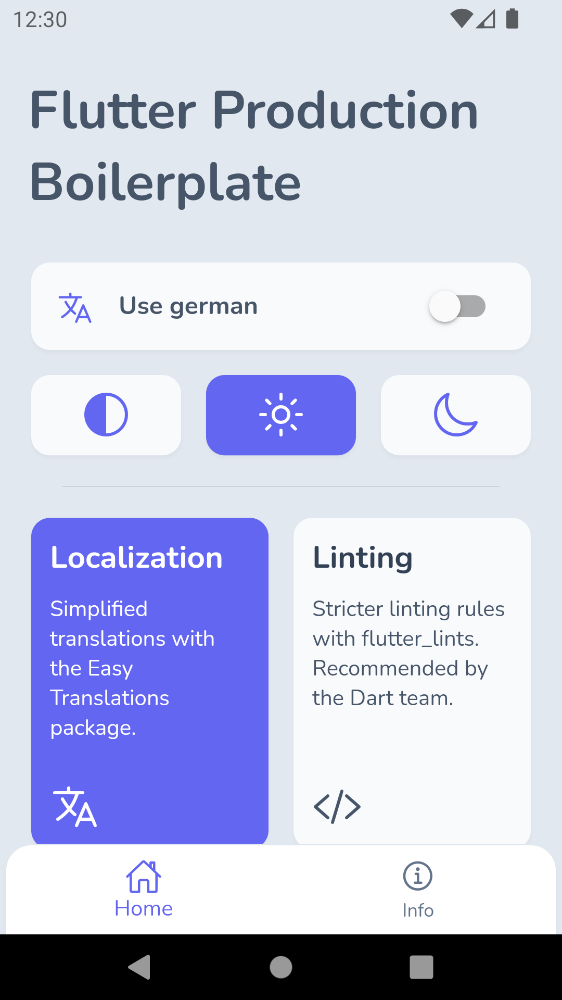
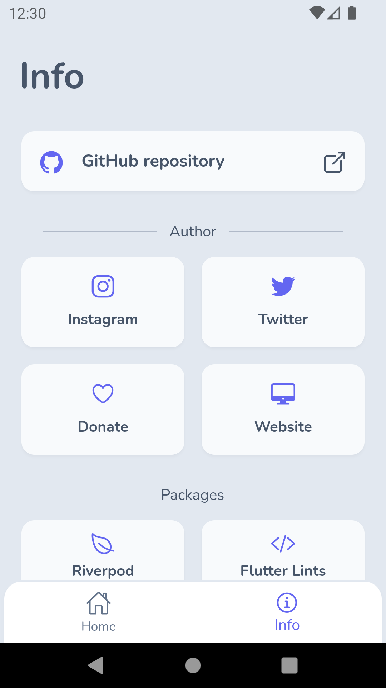
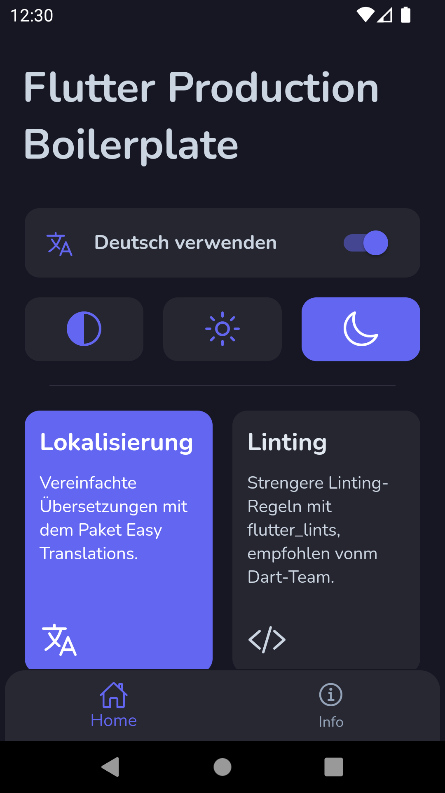
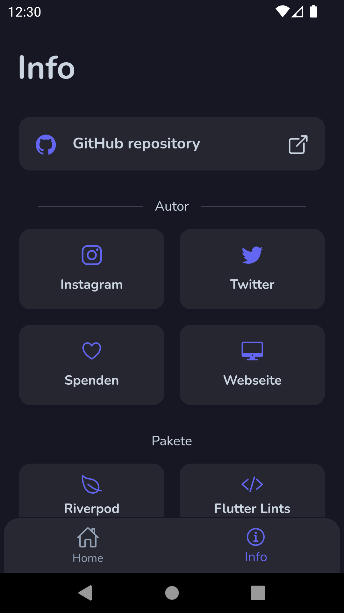

# Flutter Riverpod starter project

## A flutter project containing:

- Using Riverpod for state management.
- Using Flutter Lints for stricter linting rules.
- Using Hive for platform independent storage that also works for web.
- Project structure, const constructors, extracted widgets and many more...

## Installation

This repository requires [Flutter](https://flutter.dev/docs/get-started/install) to be installed and
present in your development environment.

Clone the project and enter the project folder.

```sh
git clone https://github.com/mosamuhana/flutter_riverpod_starter.git
cd flutter_riverpod_starter
```

Get the dependencies.

```sh
flutter pub get
```

Run the app via command line or through your development environment. (optional)

```sh
flutter run
```

## Pub packages

This repository makes use of the following pub packages:

| Package                                                             | Usage                              |
| ------------------------------------------------------------------- | ---------------------------------- |
| [Flutter Riverpod](https://pub.dev/packages/flutter_riverpod)       | State management                   |
| [Flutter Lints](https://pub.dev/packages/flutter_lints)             | Stricter linting rules             |
| [Path Provider](https://pub.dev/packages/path_provider)             | Get the save path for Hive         |
| [Flutter Displaymode](https://pub.dev/packages/flutter_displaymode) | Support high refresh rate displays |
| [Easy Localization](https://pub.dev/packages/easy_localization)     | Makes localization easy            |
| [Hive](https://pub.dev/packages/hive)                               | Platform independent storage.      |
| [Url Launcher](https://pub.dev/packages/url_launcher)               | Open urls in Browser               |
| [Ionicons](https://pub.dev/packages/ionicons)                       | Modern icon library                |

## Using this package as a starting point

After following the installation steps you can customize your project. The screens and widgets that
are inside the project can be easily replaced or removed. They are supposed to give the user a basic
understanding of the relations between widgets and some good practices. The code includes some
comments with documentation and examples. The examples can be found by searching for "Example:"
inside the project files.

### Theme

You can customize your theme colors in the [lib/src/theme.dart](./lib/src/theme.dart) file.
The project uses colors from [TailwindCSS](https://tailwindcss.com/docs/customizing-colors).
As primary swatch the indigo color palette.

#### Url Launcher

For Android go to [android/app/src/AndroidManifest.xml](./android/app/src/main/AndroidManifest.xml) and add the following code:

```
<manifest
    ...
    <queries>
        <intent>
            <action android:name="android.intent.action.VIEW" />
            <data android:scheme="https" />
        </intent>
    </queries>
    ...
</manifest>
```

## Screenshots

#### Light Theme

| Home Light                                                                      | Info Light                                                                      |
| ------------------------------------------------------------------------------- | ------------------------------------------------------------------------------- |
|  |  |

#### Dark Theme

| Home Dark German                                                             | Info Dark German                                                             |
| ---------------------------------------------------------------------------- | ---------------------------------------------------------------------------- |
|  |  |

## License

MIT
